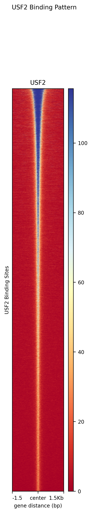

# ChIP-seq

## STEP 1 — Create environment and install Mamba
```
conda create -n Chip_Homer python=3.10 -y
conda activate Chip_Homer

conda config --add channels defaults
conda config --add channels bioconda
conda config --add channels conda-forge
conda config --set channel_priority flexible

conda install -y -c conda-forge mamba

sudo apt install python3-pyfaidx
conda install bioconda::ucsc-bigwiginfo

### Install all tools using MAMBA (FAST)
mamba install -y wget samtools sra-tools trim-galore bedtools picard bwa deeptools \
  r-essentials bioconductor-deseq2 bioconductor-edger \
  ucsc-bedgraphtobigwig ucsc-fetchchromsizes ucsc-bedtobigbed

mamba install -c bioconda macs2=2.2.7.1 -y

### Install HOMER (SAFE WAY)
mkdir -p ~/homer
cd ~/homer

wget http://homer.ucsd.edu/homer/configureHomer.pl
perl configureHomer.pl -install

###  Add HOMER to PATH SAFELY (GLOBAL, NOT CONDA)
echo 'export PATH=$HOME/homer/bin:$PATH' >> ~/.bashrc
source ~/.bashrc

###  Install hg38 annotation
perl ~/homer/configureHomer.pl -install hg38


```


## STEP 2 — Download Reference Genome (hg38 BWA Index)
```
mkdir -p BWA_Index_hg38
cd BWA_Index_hg38

wget https://ftp.ebi.ac.uk/pub/databases/gencode/Gencode_human/release_49/GRCh38.primary_assembly.genome.fa.gz
gunzip GRCh38.primary_assembly.genome.fa.gz

###  Build BWA index
bwa index BWA_Index_hg38/GRCh38.primary_assembly.genome.fa

```


## STEP 3 — Download Example ChIP-seq Data (HepG2, USF2)
```
mkdir -p GSE104247/raw
cd GSE104247/raw

# Control sample
prefetch SRR6117732
fasterq-dump --split-files SRR6117732/SRR6117732.sra

# USF2 ChIP sample
prefetch SRR6117703
fasterq-dump --split-files SRR6117703/SRR6117703.sra

# Compress for storage
gzip *.fastq


mv SRR6117703.fastq.gz SRR6117703_USF2.fastq.gz
mv SRR6117732.fastq.gz SRR6117732_Input.fastq.gz

```


## STEP 4 — Adapter Trimming + FastQC
```
mkdir -p GSE104247/trim

trim_galore --fastqc --cores 2 \
    GSE104247/raw/SRR6117703_USF2.fastq.gz \
    --output_dir GSE104247/trim

trim_galore --fastqc --cores 2 \
    GSE104247/raw/SRR6117732_Input.fastq.gz \
    --output_dir GSE104247/trim

```


## STEP 5 — Alignment with BWA-MEM
```
mkdir -p GSE104247/bam


# USF2
bwa mem -t 2 -M \
    -R "@RG\tID:USF2\tSM:USF2\tPL:ILLUMINA" \
    BWA_Index_hg38/GRCh38.primary_assembly.genome.fa \
    GSE104247/trim/SRR6117703_USF2_trimmed.fq.gz \
    > GSE104247/bam/USF2.sam

# Input
bwa mem -t $THREADS -M \
    -R "@RG\tID:INPUT\tSM:INPUT\tPL:ILLUMINA" \
    BWA_Index_hg38/GRCh38.primary_assembly.genome.fa \
    GSE104247/trim/SRR6117732_Input_trimmed.fq.gz \
    > GSE104247/bam/Input.sam

```


## STEP 6 — Convert SAM → BAM, Sort, Index
```
cd GSE104247/bam

# Convert SAM → BAM
samtools view -@ 2 -S -b USF2.sam > USF2.bam
samtools view -@ 2 -S -b Input.sam > Input.bam

# Sort
samtools sort -@ 2 USF2.bam -o USF2.sorted.bam
samtools sort -@ 2 Input.bam -o Input.sorted.bam

# Index
samtools index USF2.sorted.bam
samtools index Input.sorted.bam

```


## STEP 7 — Remove PCR Duplicates
```
picard MarkDuplicates \
    I=USF2.sorted.bam \
    O=USF2_dedup.bam \
    M=USF2_metrics.txt \
    REMOVE_DUPLICATES=true

picard MarkDuplicates \
    I=Input.sorted.bam \
    O=Input_dedup.bam \
    M=Input_metrics.txt \
    REMOVE_DUPLICATES=true

samtools index USF2_dedup.bam
samtools index Input_dedup.bam

```


## STEP 8 — Filter Blacklisted Regions
```
mkdir -p blacklists
cd blacklists

wget https://github.com/Boyle-Lab/Blacklist/raw/master/lists/hg38-blacklist.v2.bed.gz
gunzip hg38-blacklist.v2.bed.gz
cd ..

# Filter USF2
bedtools intersect -v \
    -abam GSE104247/bam/USF2_dedup.bam \
    -b blacklists/hg38-blacklist.v2.bed \
    > GSE104247/bam/USF2_blacklist_filtered.bam

# Filter Input
bedtools intersect -v \
    -abam GSE104247/bam/Input_dedup.bam \
    -b blacklists/hg38-blacklist.v2.bed \
    > GSE104247/bam/Input_blacklist_filtered.bam

samtools index GSE104247/bam/USF2_blacklist_filtered.bam
samtools index GSE104247/bam/Input_blacklist_filtered.bam

```


## STEP 9 — Remove Low-quality Reads (MAPQ < 30)
```
samtools view -b -q 30 GSE104247/bam/USF2_blacklist_filtered.bam > GSE104247/bam/USF2_final.bam
samtools view -b -q 30 GSE104247/bam/Input_blacklist_filtered.bam > GSE104247/bam/Input_final.bam

samtools index GSE104247/bam/USF2_final.bam
samtools index GSE104247/bam/Input_final.bam

```


## STEP 10 — Generate BigWig (deepTools)
```
mkdir -p GSE104247/bam/bigwig

bamCoverage \
  -b GSE104247/bam/USF2_final.bam \
  -o GSE104247/bam/bigwig/USF2.bw \
  --binSize 10 \
  --normalizeUsing RPGC \
  --effectiveGenomeSize 2913022398 \
  -p 2

bamCoverage \
  -b GSE104247/bam/Input_final.bam \
  -o GSE104247/bam/bigwig/Input.bw \
  --binSize 10 \
  --normalizeUsing RPGC \
  --effectiveGenomeSize 2913022398 \
  -p 2

```


## STEP 11 — HOMER Tag Directories
```
mkdir -p homer

makeTagDirectory homer/USF2_tags  GSE104247/bam/USF2_final.bam  -genome hg38
makeTagDirectory homer/Input_tags GSE104247/bam/Input_final.bam -genome hg38

```


## STEP 12 — HOMER Peak Calling
```
findPeaks \
    homer/USF2_tags \
    -style factor \
    -i homer/Input_tags \
    -fdr 0.001 \
    -o homer/USF2_peaks.tsv

```


## STEP 13 — MACS2 Peak Calling
```
mkdir -p peaks_USF2

macs2 callpeak \
    -t GSE104247/bam/USF2_final.bam \
    -c GSE104247/bam/Input_final.bam \
    -f BAM \
    -g hs \
    -n USF2 \
    --outdir peaks_USF2 \
    --keep-dup all \
    -q 0.01

```


## STEP 14 — Motif Discovery (HOMER)
```
findMotifsGenome.pl \
    peaks_USF2/USF2_peaks.narrowPeak \
    hg38 \
    homer_motifs \
    -size 200

```


## STEP 15 — Differential Binding / Heatmaps
```
computeMatrix reference-point \
  --referencePoint center \
  -b 2000 -a 2000 \
  -R peaks_USF2/USF2_peaks.narrowPeak \
  -S GSE104247/bam/bigwig/USF2.bw \
  -o matrix_USF2.gz

plotHeatmap -m matrix_USF2.gz -o heatmap_USF2.png

```


## STEP 16 — Convert peak files to BED format
```
mkdir -p homer/USF2

# 16A. Make chromosome sizes from UCSC
fetchChromSizes hg38 > homer/hg38.chrom.sizes

# 16B. Convert HOMER peaks to BED format
pos2bed.pl homer/USF2_peaks.tsv > homer/USF2/USF2_peaks.bed

# 16C. Sort BED
LC_ALL=C sort -k1,1 -k2,2n \
    homer/USF2/USF2_peaks.bed \
    -o homer/USF2/USF2_peaks_sorted.bed

# 16D. Filter non-standard contigs (required for bigBed)
grep -E "^(chr[0-9XYM]+)" homer/USF2/USF2_peaks_sorted.bed \
    > homer/USF2/USF2_peaks_sorted.primary.bed

# 16E. Convert to bigBed
bedToBigBed \
    homer/USF2/USF2_peaks_sorted.primary.bed \
    homer/hg38.chrom.sizes \
    homer/USF2/USF2_peaks.bb

```


## STEP 17 — BigWig signal tracks (deepTools)
```
# USF2 ChIP bigWig
bamCoverage \
    --bam GSE104247/bam/USF2_final.bam \
    --outFileName GSE104247/bam/bigwig/USF2.bw \
    --binSize 10 \
    --normalizeUsing RPKM \
    --effectiveGenomeSize 2913022398 \
    --numberOfProcessors 2

# Input control bigWig
bamCoverage \
    --bam GSE104247/bam/Input_final.bam \
    --outFileName GSE104247/bam/bigwig/Input.bw \
    --binSize 10 \
    --normalizeUsing RPKM \
    --effectiveGenomeSize 2913022398 \
    --numberOfProcessors 2


samtools faidx BWA_Index_hg38/GRCh38.primary_assembly.genome.fa

cut -f1,2 BWA_Index_hg38/GRCh38.primary_assembly.genome.fa.fai \
  > hg38.from_fasta.chrom.sizes

makeUCSCfile homer/USF2_tags \
  -o auto \
  -i homer/Input_tags \
  -bigWig hg38.from_fasta.chrom.sizes \
  -style chipseq

```




